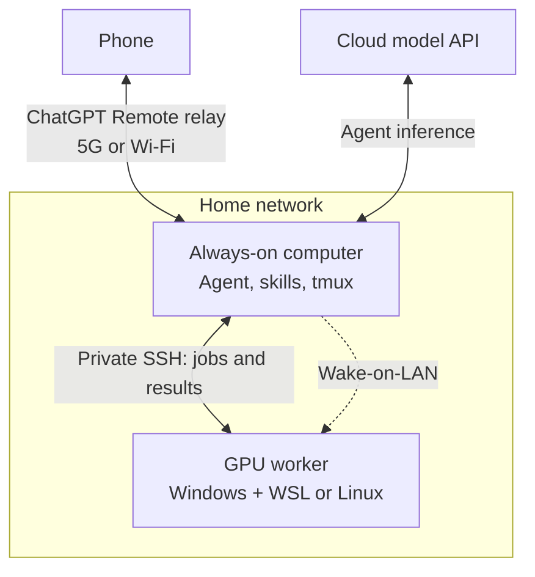

# Replication runbook

Read this file and both skills before acting. Run orchestration on a **Mac/Linux coordinator**, not on the phone or Windows worker. Inventory first; get account-owner approval before system changes. Never change the Windows SSH default shell, introduce portproxy, disable host-key checks, or put a personal PC to sleep as a test.

## Architecture



## 0. Coordinator and phone setup

Use **Mac as the default coordinator**: helpers support Mac/Linux, while ChatGPT Remote hosts support Mac/Windows. Linux coordinators need their own supported authenticated remote channel; this runbook supplies none. Windows coordination is not implemented by the helpers. Worker options are in section 2.

These steps describe owner-approved preparation, not automatic system changes. Inventory first and reuse existing setup.

**Install coordinator tools.** Install missing Python 3, SSH client, Git, Bash and tmux using an owner-approved package manager. Examples for an existing approved Homebrew or Debian/Ubuntu setup—choose your platform and only missing packages. macOS already supplies SSH and Bash.

```sh
# macOS, with existing Homebrew:
brew install python git tmux

# Debian/Ubuntu coordinator; this does not provide phone pairing:
sudo apt-get update && sudo apt-get install python3 openssh-client git bash tmux
```

Verify in the coordinator shell the agent will use:

```sh
command -v python3 ssh git tmux
command -v bash
python3 --version
```

**Pair the phone.** Follow [ChatGPT Remote](https://learn.chatgpt.com/docs/remote-connections): latest desktop ChatGPT (Mac/Windows), latest phone app (iOS/Android), same account/workspace, Codex access, and required MFA/policies. Desktop: **Settings > Connections > Control this Mac or PC > Set up/Add**; scan the QR on your phone and confirm Remote. CLI/IDE alone cannot pair. If rollout/workspace policy makes Remote unavailable, stop phone setup—no public-server workaround.

Keep the desktop app running and host awake/online. The authenticated relay works over 5G without WAN ingress. Configure the agent's project, tools, and skills on the coordinator. Enable Computer Use only when a job needs GUI access; retain other permission checks. The GPU worker needs no Codex installation for these SSH jobs.

**Keep the coordinator available.** If available, **Settings > Connections > Keep this Mac awake** prevents plugged-in host sleep while Remote is enabled. Alternatively, the owner can choose **System Settings > Energy > Prevent automatic sleeping when the display is off**; [availability varies by macOS/hardware](https://support.apple.com/en-gb/guide/mac-help/mchle41a6ccd/mac). Choose and verify an awake setting while plugged in. Display locking can remain enabled; leave FileVault and login settings unchanged. After reboot or power loss, local login, app launch and SSH-key unlock may be required; do not assume automatic recovery.

Keep the coordinator powered and connected to the home LAN. Linux coordinators also need an owner-approved stay-awake policy. tmux alone does not prevent sleep.

**Open the project and continue setup.** Clone using the README commands on the coordinator, or use the reviewed clone already there. Open the clone root as the agent's local project; authorize its workdir/shell and the dedicated SSH key once section 3 is complete. Install the skills using section 1. Keep API keys in a private credential store, never the repo, machine config or worker jobs. Record device addresses/MACs in private configuration outside git; the owner verifies private LAN addresses and router reservations before section 4. Complete the remaining sections and the final ready check before real work.

## 1. Private configuration and skill installation

From the reviewed repository root on the coordinator:

```sh
umask 077
install -d -m 700 "$HOME/.config/phone-mini-gpu"
cp -n machine.example.json "$HOME/.config/phone-mini-gpu/machine.json"
chmod 600 "$HOME/.config/phone-mini-gpu/machine.json"
```

Edit that private copy, never the tracked example. Identify whether SSH lands in Windows cmd/PowerShell (`windows-wsl`) or an existing Linux/WSL shell (**must use `linux`**). Linux transport can omit the WSL fields. Model/provider credentials do not belong in this configuration.

Review the scripts, then install these skill symlinks; existing entries are not overwritten:

```sh
repo="$PWD"
mkdir -p "$HOME/.codex/skills"
for name in wake-gpu gpu-compute; do
  dest="$HOME/.codex/skills/$name"
  if [ -e "$dest" ] || [ -L "$dest" ]; then printf 'Refusing existing %s\n' "$dest"; else ln -s "$repo/skills/$name" "$dest"; fi
done
```

Other agents/loaders must load the relevant `SKILL.md` manually if they do not support this layout. Keep the clone at its reviewed location.

## 2. Worker account, packages, and firewall

**Choose the worker path first.** The instructions below cover Windows/WSL. Native Linux GPU PCs and NVIDIA servers use `linux` transport: skip Windows/WSL setup and Windows power requests, install the appropriate Linux packages/drivers, and restrict SSH to the coordinator. The runner requires Linux, GNU coreutils, and a job directory on the worker's Linux home filesystem. A Mac Pro/Studio worker needs a macOS-native runner and compatible framework; the supplied runner rejects macOS.

Use an ordinary, non-administrator Windows SSH account, keys rather than passwords, and a non-root WSL user. The distribution must be installed for that **same Windows account**; another account's distribution is not sufficient. Follow the existing-system setup guidance:

- https://learn.microsoft.com/en-us/windows-server/administration/openssh/openssh_install_firstuse
- https://learn.microsoft.com/en-us/windows-server/administration/openssh/openssh_keymanagement
- https://learn.microsoft.com/en-us/windows/wsl/install
- https://learn.microsoft.com/en-us/windows/ai/directml/gpu-cuda-in-wsl

From that Windows account's console, inspect `wsl.exe --list --verbose`, then `wsl.exe --distribution Ubuntu-24.04 --user REPLACE_WITH_WSL_USER --exec id`. Confirm a non-root UID. Owner-approved Ubuntu package installation, inside Linux/WSL: `sudo apt-get update && sudo apt-get install bash coreutils python3 python3-venv git`. Use the Windows NVIDIA/WSL driver path, not a Linux display-driver installation inside WSL. Ordinary Linux workers need their appropriate native GPU driver.

Check the RAM and CPU allocation visible inside WSL during preflight; it may be smaller than the Windows host's resources. Install training frameworks and other workload dependencies in a job-local environment matched to the GPU.

**Windows SSH service.** Inspect `Get-Service sshd`; if missing, the owner installs **OpenSSH Server** through Optional Features using [Microsoft's setup instructions](https://learn.microsoft.com/en-us/windows-server/administration/openssh/openssh_install_firstuse). The installer creates a broad inbound firewall allow, so complete the all-rules review and approved narrowing below **before starting a newly installed service**. Once scoped, an owner-approved administrator runs:

```powershell
Set-Service -Name sshd -StartupType Automatic
if ((Get-Service sshd).Status -eq 'Stopped') { Start-Service sshd }
Get-Service sshd
```

Do not restart an existing service, replace SSH configuration or add a broad rule.

Inspect **all existing inbound allow rules covering the configured SSH port**, including custom rules. Show the owner their exact names, current profiles/address filters, and proposed adjustments before mutation. An approved administrator, not the compute agent, performs necessary changes. Examples for inspection and a proposed adjustment:

```powershell
Get-NetFirewallRule -Direction Inbound -Action Allow | Get-NetFirewallPortFilter | Format-Table InstanceID,Protocol,LocalPort
Get-NetFirewallRule -Name 'REPLACE_WITH_EXISTING_RULE' | Format-List Name,Enabled,Profile,Direction,Action
Get-NetFirewallRule -Name 'REPLACE_WITH_EXISTING_RULE' | Get-NetFirewallAddressFilter
# Only after showing the exact existing-rule changes and receiving approval:
Set-NetFirewallRule -Name 'REPLACE_WITH_EXISTING_RULE' -Profile Private -RemoteAddress 'REPLACE_WITH_COORDINATOR_LAN_IP'
```

Scope Windows SSH to the mini/coordinator LAN IP on the **Private** profile. Resolve any other overlapping broad allows through individually approved existing-rule adjustments; do not add broader duplicates. Do not automatically change network profiles. Apply equivalent least-privilege restrictions for Linux.

## 3. SSH identity and host trust

Use a dedicated coordinator key, e.g. owner-run `ssh-keygen -t ed25519 -f ~/.ssh/REPLACE_WITH_DEDICATED_KEY`. Install only its public key using the account-specific official instructions. Unlock a protected key locally with `ssh-add ~/.ssh/REPLACE_WITH_DEDICATED_KEY` if needed; never forward it. Review and add, without replacing unrelated configuration:

```sshconfig
Host gpu
    HostName REPLACE_WITH_WORKER_LAN_IP
    User REPLACE_WITH_SSH_ACCOUNT
    Port 22
    IdentityFile ~/.ssh/REPLACE_WITH_DEDICATED_KEY
    IdentitiesOnly yes
    ForwardAgent no
    ForwardX11 no
    ClearAllForwardings yes
    StrictHostKeyChecking yes
```

The alias controls SSH's destination/port; match `ssh_lan_ip`/`ssh_port` to it for the wake probe. **First** obtain the fingerprint at the worker console: Windows `ssh-keygen.exe -lf "$env:ProgramData\ssh\ssh_host_ed25519_key.pub"`, or Linux `ssh-keygen -lf /etc/ssh/ssh_host_ed25519_key.pub`. Then collect a candidate on the coordinator:

```sh
install -d -m 700 "$HOME/.ssh"
ssh-keyscan -t ed25519 -p 22 REPLACE_WITH_WORKER_LAN_IP > "$HOME/.config/phone-mini-gpu/hostkey.review"
ssh-keygen -lf "$HOME/.config/phone-mini-gpu/hostkey.review"
# STOP unless this exactly matches the independently checked console fingerprint.
# Only after matching; never accept a changed key automatically:
cat "$HOME/.config/phone-mini-gpu/hostkey.review" >> "$HOME/.ssh/known_hosts"
chmod 600 "$HOME/.ssh/known_hosts"
```

`ssh-keyscan` is not authentication. Investigate mismatches with the owner rather than deleting trust records or weakening checks.

## 4. Wake and capacity preflight

WOL needs the connected **wired NIC's MAC**, a same-LAN source IP actually assigned to the coordinator, and the LAN's real broadcast address. Reserve worker/coordinator IPs. BIOS, NIC, sleep-state, and Fast Startup behavior are manual/vendor-specific. Do not infer a /24 subnet or repair networking automatically.

For a Windows worker, have the owner enable the motherboard's Wake-on-LAN/PCIe wake setting according to its manual. In **Device Manager → Network adapters → Ethernet adapter → Properties**, enable **Wake on Magic Packet** under Advanced and allow the adapter to wake the computer under Power Management, where offered. Prefer magic-packet-only wake. Names and availability vary; see your adapter's documentation ([Intel example](https://www.intel.com/content/www/us/en/support/articles/000059062/ethernet-products/intel-killer-ethernet-products.html)). Keep wake traffic on the LAN; internet-wake features are unnecessary here.

Skip waking an already-awake worker. Verify the machine's supported sleep state; waking from powered-off states is not guaranteed. The magic-packet helper does not provide server BMC power control. The preflight below assumes NVIDIA hardware; substitute the appropriate GPU check for other hardware or CPU-only jobs.

```sh
python3 skills/wake-gpu/scripts/wake.py --dry-run
printf '%s\n' 'set -eu' 'uname -a; id; free -h; df -h .; nvidia-smi' | python3 skills/gpu-compute/scripts/worker.py run
echo "worker exit=$?"
```

Agree during setup whether authorized compute jobs may wake the worker. Honor that preference on later jobs; do not ask again for an already-authorized wake. When needed, run `python3 skills/wake-gpu/scripts/wake.py`; never sleep a personal PC to test it. The probe establishes TCP reachability, not SSH authentication. If it fails, report the stage reached without changing the network. Inspect the preflight exit status and printed `CHANGES.md`/`job.log` paths. Keep inventory output private.

## 5. Phone persistence and power

Continue in [gpu-compute/SKILL.md](skills/gpu-compute/SKILL.md): from the phone, launch its two-minute heartbeat inside coordinator tmux, disconnect the phone, reconnect, and inspect timestamps and lifecycle logs. The coordinator must remain awake/online; tmux is not an awake request.

Windows may idle-sleep despite GPU load. With `transport: windows-wsl`, `worker.py run` requests system-awake state before starting WSL and releases it when the command finishes, including failure. `awake_seconds` limits that request (default 46,800 seconds / 13 hours; maximum 24 hours); reaching the limit releases the request while the job continues. Choose enough time for the job plus saving. `exec` does not hold the PC awake. This changes no power plan and lets the display sleep.

For an existing `transport: linux` SSH endpoint that enters WSL, automatic Windows sleep inhibition is unavailable. Arrange the bounded request before leaving, or have your agent run this reviewed script through an existing **persistent foreground Windows SSH connection**. Do not assume detached WSL interop survives its launching connection. The basic manual fallback is to copy `keep-awake.ps1` to Windows and run in its containing directory:

```powershell
powershell.exe -NoProfile -File .\keep-awake.ps1 -Seconds 7200
# In a second Windows terminal, before a long job:
powercfg /requests
```

The owner may need an approved administrator terminal for the read-only `powercfg /requests` check. Confirm the system-awake request actually appears; do not assume GPU load or detached WSL interop keeps Windows awake. Follow existing script-execution policy rather than bypassing it. Optional `-StopFile` must be an explicitly chosen absolute Windows path; creating it releases the request within 15 seconds. Ctrl+C or expiry also releases it. Verify release afterward. No power-plan edits, automatic shutdown, or automatic sleep: let normal idle policy apply. Neither tmux nor this request survives/reliably prevents reboots.

**Native Linux workers:** `linux` transport supplies no sleep inhibition. Have the owner verify that the SSH service (`ssh`/`sshd`) is available and starts at boot using the platform's service tools; approve any changes first. Use an existing approved power policy or bounded sleep inhibitor covering computation and saving. Verify effectiveness and release any temporary inhibitor afterward. Never automatically suspend, hibernate or shut down.

## 6. Ready check

- [ ] Turn phone Wi-Fi off and open Remote to the Mac coordinator over cellular data. Linux uses its own supported authenticated channel.
- [ ] Run wake only if the worker is already asleep and waking is authorized; skip if awake. Never put a personal PC to sleep as a test.
- [ ] Pass section 4's SSH/GPU/capacity preflight with exit code 0.
- [ ] From the phone, launch the [two-minute heartbeat](skills/gpu-compute/SKILL.md#phone-disconnect-test-and-persistent-jobs) in coordinator tmux. With Wi-Fi still off, disconnect the phone for at least 30 seconds during the job, then return. Timestamps must continue across the gap; worker and tee exit codes must both be 0.
- [ ] Verify the Windows awake request is active during the job and released afterward using section 5's procedure. For native Linux, verify approved sleep inhibition and release any temporary inhibitor.
- [ ] Retrieve `result.txt` containing `ok`, `job.log` with START/FINISH records, and `CHANGES.md` into a private coordinator directory.

Passing demonstrates phone/laptop-disconnect persistence, not reboot recovery. Both machines still need power and connectivity.

## Publication

Keep benchmark measurements and updates locally outside git first. Record fixed held-out loss/ppl over iterations, timings, workload/evaluation settings, and limitations. Publish only reviewed measured summaries. Keep credentials, machine addresses, raw logs, and unreviewed screenshots out of git. Remove private usernames, paths, and host identifiers unless the owner explicitly chooses to share those specific details; review embedded image metadata too. The included phone screenshot is owner-approved; that is not permission to publish other local information. Do not fabricate performance or quality conclusions.
