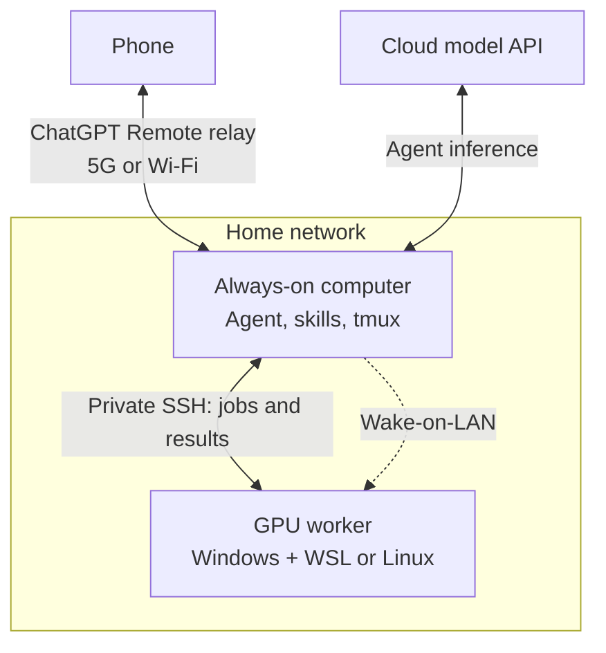
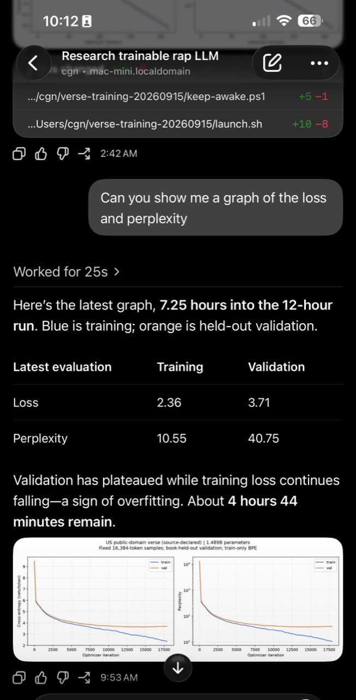

# Run Agents while Trail Running

How to set up AI agents to run compute-intensive work from your phone while you're out on a trail run. Point your agent at this repo to help configure the setup for your devices.

You need three things:

1. A phone.
2. An inexpensive, always-on computer, such as a used M1 Mac mini, to coordinate the work.
3. A computer with at least one capable GPU, such as a gaming PC or deep-learning rig. GPU memory, RAM, CPU cores, and storage should fit the jobs you want to run.



The coordinator stays awake; the GPU worker can sleep between jobs. Phone access uses an authenticated relay; SSH and wake traffic stay on the home LAN.

## Quick start

**Default: Mac coordinator.** Follow [section 0](AGENTS.md#0-coordinator-and-phone-setup) for tools and phone pairing. Clone on the coordinator:

```sh
git clone https://github.com/cgnorthcutt/run-agents-while-trail-running.git
cd run-agents-while-trail-running
```

Give your agent:

> Read [AGENTS.md](AGENTS.md) and both linked skills. Set this up for my devices. Preserve settings and authorizations, keep machine details private, and verify wake, SSH, GPU access and progress across a phone disconnect.

<p align="center">
  
</p>

*Interim progress report; benchmark details and graph below.*

## Skills and platforms

- [wake-gpu](skills/wake-gpu/SKILL.md): authorized LAN wake and reachability checks.
- [gpu-compute](skills/gpu-compute/SKILL.md): benchmark-guided jobs, logs, temporary Windows awake requests and result retrieval.

The documented setup uses a **Mac coordinator**. Linux coordinators need their own authenticated phone connection; Windows coordinators need adapted helpers.

| GPU worker | Support |
|---|---|
| Windows PC with WSL | Tested with an RTX 5090; temporary awake requests cover each job. |
| Linux rig or NVIDIA server | Use `linux` transport and manage sleep separately. |
| Mac Pro or Studio | Needs a macOS runner and compatible framework; current scripts require Linux. |

Wake-on-LAN needs wired Ethernet and compatible firmware/NIC/sleep settings; skip wake if already awake.

## Progress

Ask: **“Show this job's progress and latest logs.”** Or open the coordinator terminal:

```sh
tmux ls
tmux attach -t REPLACE_WITH_PRINTED_SESSION
```

Detach with **Ctrl-b, then d**. Jobs continue across phone disconnects while both computers remain powered and connected. See the [compute skill](skills/gpu-compute/SKILL.md) for logs and results.

## The nanoGPT example

I started training a 1.49B-parameter nanoGPT model from scratch over 5G on a trail run. My ~$200 used 2020 M1 Mac mini coordinated an RTX 5090 PC with 128 GB RAM.

The **7.25-hour snapshot** below comes from the 12-hour experiment on source-declared US public-domain verse. Validation plateaued while training loss fell, suggesting overfitting. [Benchmark notes](skills/gpu-compute/references/benchmarks.md) cover settings and limitations. Bring your own code/data; the custom training loop is not included.


## Keep it private

Use ordinary accounts, dedicated SSH keys and verified host keys. Keep SSH LAN-scoped; expose no public servers or dashboards. Credentials, addresses and raw logs stay out of git. Job directories aren't sandboxes; WSL can access Windows files.
