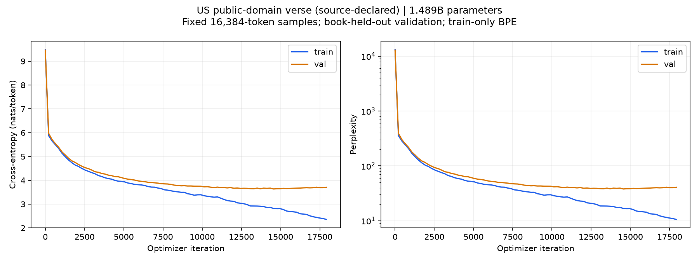

# Benchmarks and compute routing

**Repository:** `phone-mini-codex-gpu` · **Date:** 2026-09-15

These measurements help an agent choose where to run work. The repository supplies the compute setup; the custom training loop and dataset preparation are not included.

## Hardware and synthetic comparison

| System | Hardware / allocation |
|---|---|
| Mac mini (2020) | Apple M1; 8 CPU cores, 8 GPU cores; 16 GiB RAM |
| Gaming host (Windows) | Ryzen 9 9950X3D; **128 GB physical RAM, user-reported** |
| Worker’s WSL guest | **16 logical CPUs; 45.8 GiB allocated RAM**, distinct from host resources |
| Worker GPU | RTX 5090; 32,607 MiB VRAM; SM 12.0 |

Three sequential **60-second phases**—CPU-only, GPU-only, then mixed CPU/GPU—ran concurrently across hosts. CPU tests used **four workers**, with Python **3.12.3 on WSL versus 3.9.6 on the mini**: a software-version confound.

| Phase / metric | Mini | Worker | Reported worker/mini |
|---|---:|---:|---:|
| CPU-only, million arithmetic updates/s | 90.44 | 263.33 | 2.91× |
| GPU-only, FP32 GFLOP/s | 306 | 20,007 | 65.34× |
| Mixed CPU, million arithmetic updates/s | 90.70 | 253.03 | 2.79× |
| Mixed GPU, FP32 GFLOP/s | 322 | 18,842 | 58.49× |

The GPU kernel used **CUDA PTX versus Metal**, with 262,144 elements and 1,024 dependent FP32 FMAs per element per dispatch. Timings include dispatch/synchronization; the kernel **did not fully saturate the 5090**. This is not GEMM/tensor-core throughput, a universal training speedup, or a full ML workload suite.

## Routing policy

- Keep fast, short tasks on the mini unless the user explicitly requests **all compute on the worker**.
- Route substantial CPU/GPU work to the worker, but benchmark the representative workload. Include **wake, transfer, initialization, evaluation, and checkpoint overhead** when choosing where to run.
- For your own local training profile, use **at least 10 warm-up and 10 measured full updates**. Record warm-up, update, evaluation, and save timings separately, alongside throughput and peak allocated/reserved memory.
- Run **one heavy job at a time**; monitor CPU/GPU temperatures and guest-RAM/VRAM headroom. Set explicit, hardware-appropriate pause/abort thresholds.
- In WSL, use the **Windows NVIDIA driver** and a CUDA-enabled PyTorch build supporting the GPU architecture. Do **not** install a Linux CUDA kernel driver inside WSL.

## nanoGPT configuration

Based on MIT-licensed [nanoGPT at the pinned commit](https://github.com/karpathy/nanoGPT/tree/3adf61e154c3fe3fca428ad6bc3818b27a3b8291). The custom training loop added per-block activation checkpointing, timing, checkpoint saves, and evaluation.

- **Model:** 1,489,488,000 fresh trainable parameters; 48 layers, width 1,600, 25 attention heads; sequence length 512; vocabulary 8,192 with byte-level BPE. Dropout 0.1, biases enabled, tied embeddings.
- **Batch:** microbatch 1 × accumulation 16 × sequence 512 = **8,192 tokens/update**.
- **Numerics:** FP32 weights, gradients, and AdamW moments; BF16 autocast; activation checkpointing on every block with `use_reentrant=False`.
- **Optimizer:** fused AdamW; peak LR `2e-4`, 100-update LR warm-up, time-based cosine decay; gradient clipping 1.0, weight decay 0.1, betas `(0.9, 0.95)`.
- **Runtime:** PyTorch `2.11.0+cu128`, CUDA 12.8; PyTorch-selected SDPA backend; no `torch.compile`.
- **Memory policy:** allocator fraction cap **0.88**, reported as **27.998 GiB**. This is **not a hard physical GPU-memory reservation**.

## Short nanoGPT benchmark

See the [raw nanoGPT benchmark](nanogpt-5090.json). Throughput excludes initialization, warm-up, evaluation, and saving. **Only two updates were measured**: this is not a sustained-throughput guarantee, and rate × 12 hours must not be reported as actual training tokens.

| Measurement | Result |
|---|---|
| One warm-up | 8.590 s |
| Two full measured updates | 1.453141859 s; 1.418245572 s |
| Mean update / throughput | **1.4356937155 s/update; 5,705.9524 tokens/s** |
| Train / validation forward evaluation | 32 × 512 tokens each; 0.59956 s / 0.59770 s |
| Best checkpoint | 5.55 GiB; 6.222 s save |
| Full model + optimizer checkpoint | ~16.65 GiB; 24.626 s save; 23.159 s replacement |
| Peak memory across warm-up, updates, evaluation, saving | 25.7506 GiB allocated; 25.9629 GiB reserved |
| Benchmark phases total | 66.726 s |

Checkpoint readback verified **structure**, not full byte-for-byte correctness, durable disk flushing, or RNG-equivalent training resumption.

**Run status:** measured phases and file validation completed, but Windows idle sleep then dropped SSH and the benchmark wrapper exited nonzero. Report these as **completed-phase measurements, not a clean end-to-end run**. This led to a temporary Windows keep-awake process.

## Actual training: interim snapshot

The experiment had a **12-hour budget**. At **7.2485 hours and 17,920 updates**, the recorded metrics were:

| Metric | Training | Held-out validation |
|---|---:|---:|
| Cross-entropy loss, nats | 2.35643 | 3.70751 |
| Perplexity | 10.5532 | 40.7522 |

Best observed validation loss: **3.636295 at update 14,556**. The plot is an **interim snapshot**, not the final 12-hour result.

## Corpus, evaluation, and interpretation

Data came from the [Gutenberg Poetry Corpus](https://github.com/aparrish/gutenberg-poetry-corpus): source-declared **US public-domain text**, with the corpus arrangement released under **CC0**. This is not a universal worldwide public-domain determination. The data is narrow-domain verse.

| Split | Books | Tokens |
|---|---:|---:|
| Training | 1,058 | 31,606,815 |
| Validation | 64 | 2,246,371 |
| Test | 69 | 1,851,238 |

Splitting used a deterministic **book-hash 90/5/5 rule**; BPE was trained on training data only. Exact normalized **16-line chunks** were deduplicated with held-out priority; partial duplication can remain.

Reported train/validation evaluations use fixed **16,384-token samples per split**, not the entire held-out set. Loss is cross-entropy in nats; **perplexity = exp(loss)**. Results are not directly comparable across different tokenizers or corpora.

Falling training loss with plateauing validation loss **suggests overfitting**, consistent with a very large model trained on ~31.6 million narrow-domain tokens. These results do not establish broad language competence. This configuration demonstrates a **practically tested fit**, not the largest possible model or the best model for a small dataset.